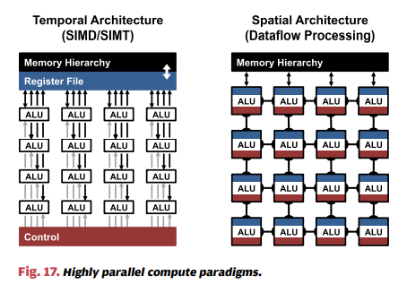
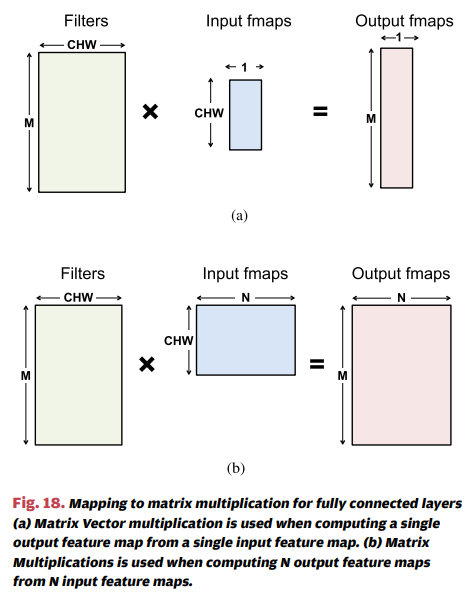
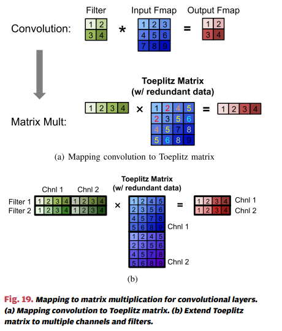

# 深度神经网络的高效处理：教程和综述
## 摘要
  >&emsp;&emsp;深度神经网络(DNN)目前广泛应用于计算机视觉、语音识别和机器人等人工智能(AI)领域。虽然DNN在许多AI任务上提供了最先进的精确度，但它以高计算复杂度为代价。因此，对于DNN在AI系统中的广泛部署而言，实现DNN的有效处理以提高能源效率和吞吐量而又不牺牲应用精度或增加硬件成本的技术至关重要。本文旨在提供一个有关实现DNN高效处理目标的最新进展的综合教程和综述。  
  &emsp;&emsp;具体来说，它将提供DNN的概述，讨论支持DNN的各种硬件平台和体系结构，并重点介绍仅通过硬件设计更改或通过联合硬件设计和DNN算法更改来降低DNN计算成本的主要趋势。  
  &emsp;&emsp;它还将总结各种开发资源，使研究人员和从业人员可以快速入门该领域，并重点介绍重要的基准测试指标和设计注意事项，用来评估正在学术界和工业界提出的快速增长的DNN硬件设计,包括算法代码设计(可选)的数量。  
  &emsp;&emsp;读者将从本文中去掉以下概念：理解DNN的关键设计考虑因素；能够使用基准和比较指标来评估不同的DNN硬件实现；了解各种硬件架构和平台之间的权衡；能够评估各种DNN设计技术对高效处理的实用性；并了解最近的部署趋势和机会。

## 1. 介绍
  > &emsp;&emsp;深度神经网络(DNN)目前是许多现代人工智能应用的基础。自从DNN在语音识别和图像识别中的突破性应用以来，使用DNN的应用数量激增。这些DNN被用于各种各样的应用，从无人驾驶汽车，到检测癌症，再到玩复杂的游戏。在许多这些领域中，DNN现在能够超越人类的准确性。  
   &emsp;&emsp;DNN的优越性能来自于它能够在对大量数据进行统计学习后，从原始的感官数据中提取高级特征，从而获得对输入空间的有效表示。这与早期使用专家设计的手工特性或规则的方法不同。  
   &emsp;&emsp;然而，DNN的高精度是以高计算复杂度为代价的。虽然通用计算引擎，尤其是图形处理单元(GPU)已经成为许多DNN处理的主要手段，但是越来越多的人对提供更专业的DNN计算加速感兴趣。本文旨在概述DNN，了解其行为的各种工具，以及为有效加速其计算而探索的技术。  
   &emsp;&emsp;本文的结构如下:  
  > + 第二节介绍了DNN的重要性、历史和应用背景。  
  > + 第三节概述了DNN的基本组件和目前使用的流行DNN模型。  
  > + 第四节描述了用于DNN研究和开发的各种资源。  
  > + 第五节介绍了用于处理DNN的各种硬件平台，以及用于在不影响应用程序准确性(即产生按位相同的结果)的情况下提高吞吐量和能效的各种优化。  
  > + 第六节讨论了如何使用新的数据处理技术来解决混合数据传输和数据处理电路的能耗问题。
  > + 第七节描述了可在DNN上执行的各种联合算法和硬件优化，以提高吞吐量和能效，同时尽量减少对准确性的影响。
  > + 第八节描述了比较各种DNN设计时应考虑的关键指标。

## 2. 深度神经网络的背景
 > 略

## 3. 深度神经网络的概述
 > 略

## 4. 深度神经网络的开发资源
 > 略

## 5. 处理深度神经网络的硬件
 > &emsp;&emsp;由于DNN的普及，许多最近的硬件平台都有针对DNN处理的特殊功能。例如，Intel Knights Mill CPU将具有用于深度学习的特殊矢量指令(译者注：应该就是指AVX-512指令集)；Nvidia PASCAL GP100 GPU具有16位浮点(FP16)运算支持，可在单个精度内核上执行两个FP16运算，以实现更快的深度学习计算。还专门为DNN处理构建了一些系统，如Nvidia DGX-1和Facebook的Big Basin定制DNN服务器。DNN推理也在各种嵌入式片上系统(SoC)(例如Nvidia Tegra和Samsung Exynos)以及现场可编程门阵列(FPGA)上进行了演示。因此，了解如何在这些平台上执行处理以及如何为DNN设计特定于应用程序的加速器以进一步提高吞吐量和能源效率是非常重要的。  
 &emsp;&emsp;卷积层(CONV)和全连接层(FC/Dense)的基本组成部分都是乘法和累加(MAC)操作，可以很容易地并行化。为了实现高性能，高度并行的计算范式非常常用，包括如图17所示的时间和空间架构。时间逻辑结构主要出现在CPU或GPU中，并采用多种技术来提高并行性，如向量(SIMD，单指令多数据流)或并行线程(SIMT，单指令多线程)。这种时间逻辑结构对大量ALU集中控制。这些ALU只能从内存层次结构中获取数据，而不能直接相互通信。相反，空间逻辑架构使用数据流处理，即ALU形成一个处理链，以便它们可以直接将数据从一个传递到另一个ALU上。有时，每个ALU都有自己的控制逻辑和本地存储器，称为暂存器或寄存器文件。我们将具有自己本地内存的ALU称为处理引擎(PE)。空间架构通常用于基于ASIC和FPGA的设计中的DNN。在本节中，我们将讨论在这些不同平台上高效处理的不同设计策略，而不会对精度产生任何影响(即，本节中的所有方法都会产生按位相同的结果)；具体来说：
 > + 对于CPU和GPU之类的时间架构，我们将讨论内核上的计算转换如何减少乘法次数以增加吞吐量。
 > + 对于加速器中使用的空间体系结构，我们将讨论数据流如何增加内存层次结构中低成本内存的数据重用性以减少能耗。
 
 >### A. 在CPU和GPU平台上加速内核计算
 >&emsp;&emsp;CPU和GPU使用SIMD或SIMT等并行化技术来并行执行MAC。所有ALU共享相同的控制器和内存(寄存器文件)。在这些平台上，FC和CONV层通常都映射到矩阵乘法(即内核计算)。图18指出了如何将矩阵乘法用于FC层。滤波器矩阵的高度是三维滤波器的数量，宽度是每个三维滤波器的权重数[输入通道(C)×宽度(W)×高度(H)，因为在FC层中R=W和S=H]；输入特征图矩阵的高度是每个三维输入特征图的激活数(C×W×H)，宽度是三维输入特征图的个数[图18(a)中的一个，图18(b)中的N)]；最后，输出特征图矩阵的高度是输出特征图中的通道数(M)，宽度是三维输出特征图的个数(N)，其中FC层的每个输出特征图的维数为1×1×N输出通道数(M)。
   
 &emsp;&emsp;DNN中的CONV层还可以使用如图19所示的Toeplitz矩阵的松弛形式映射到矩阵乘法。对CONV层使用矩阵乘法的缺点是，如图19(a)中高亮显示的，在输入特征图矩阵中存在冗余数据。这可能导致存储效率低下，或者导致复杂的内存访问模式。  
   
 &emsp;&emsp;有专为CPU(例如OpenBLAS，Intel MKL等)和GPU(例如cuBLAS，cuDNN等)设计的软件库，它们针对矩阵乘法进行了优化。矩阵乘法被平铺到这些平台的存储层次结构中，在更高的级别上，这些存储层次结构大约为几兆字节。  
 &emsp;&emsp;这些平台上的矩阵乘法可以通过对数据应用计算变换来进一步加快，以减少乘法的次数，同时仍然给出相同的按位结果。这通常会以增加的添加数量和更不规则的数据访问模式为代价。  
 &emsp;&emsp;快速傅立叶变换(FFT)，是一种众所周知的方法，如图20所示，该方法将乘法次数从$O(N^2_oN^2_f)$减少到$(N^2_olog_2N_o)$，其中输出大小为$N_o×N_o$，滤波器大小为$N_f×N_f$。为了进行卷积，我们对滤波器和输入特征图进行FFT操作，然后在频域中进行乘法。然后，我们对所得乘积应用IFFT，以恢复空间域中的输出特征图。但是，使用FFT有几个缺点：  
 > 1. FFT的好处随着滤波器的大小而降低  
 > 2. FFT的大小取决于输出特征图的大小，通常比滤波器大得多
 > 3. 频域中的系数是复数  

 > &emsp;&emsp;结果，尽管FFT减少了计算量，但它需要更大的存储容量和带宽。 最后，降低复杂度的一种流行方法是使权重稀疏，这将在VII-B2节中讨论。使用FFT使得这种稀疏性难以利用。  
 &emsp;&emsp;可以对FFT进行一些优化，以使其对DNN更高效。为了减少运算量，可以预先计算并存储滤波器的FFT结果。此外，输入特征图的FFT可以计算一次，并用于在输出特征图中生成多个通道。最后，由于图像仅包含实数值，因此其傅里叶变换是对称的，可以利用它来减少存储和计算成本。  
 &emsp;&emsp;与FFT类似，Winograd的算法将变换应用于特征图和过滤器，以减少卷积所需的乘法次数。Winograd是逐块应用的，乘法的减少量取决于滤波器和块的大​​小。块大小越大，则乘法的减少越大，但代价是变换的复杂度越高。一个特别有吸引力的滤波器尺寸是3×3，当计算2×2输出块时，它可以将乘法的次数减少2.25倍。请注意，Winograd需要根据滤波器和块的大​​小进行专门处理。
 &emsp;&emsp;Strassen算法也被用于减少DNN中的乘法数。它以递归的方式重新安排排列矩阵乘法的计算，以将乘法的次数从$O(N^3)$减少到$O(N^{2.807})$。然而，Strassen的好处是以增加存储需求为代价的，有时还会降低数值稳定性。  
 &emsp;&emsp;实际上，对于不同的层形状和大小，可以使用不同的算法(例如，对于大于5×5的滤波器使用FFT，对于小于等于3×3的滤波器使用Winograd)。现有的平台库(例如MKL和cuDNN)针对给定的形状和大小动态选择适当的算法。  
 >### B. 用于加速器的节能数据流  

## 6. 近数据处理
 > 略

## 7. DNN模型与硬件的联合设计
 > 略

## 8. 用于DNN评估的评测指标及其比较
 > 略

## 9. 总结
 > &emsp;&emsp;近几年来，DNN的使用呈爆炸式增长。它们目前被广泛应用于许多人工智能应用，包括计算机视觉、语音识别和机器人技术，并且通常具有比人类更高的准确性。但是，尽管DNN可以提供出色的准确性，但是却以高计算复杂度为代价。因此，利用经济高效的硬件实现DNN高效处理以提高效能和吞吐量而又不牺牲准确性的技术对于在现有和新领域中扩展DNN的部署至关重要。  
 &emsp;&emsp;要创建一个用于高效DNN处理的系统时，应首先了解当现在和未来的应用以及现在所需的特定计算以及这些计算的潜在发展。本文综述了许多现在的DNN应用，重点是计算机视觉应用，相关的算法，以及用于驱动算法的数据。这些应用程序、算法和输入数据正在经历快速变化。因此，推断这些趋势，以确定处理下一代计算所需的灵活性程度，成为任何设计项目的重要组成部分。  
 &emsp;&emsp;在设计空间探索过程中，理解和平衡重要的系统指标至关重要。对于DNN计算来说，这包括精度，能量，吞吐量和硬件成本。当然，评估这些度量是关键，因此本文综述了DNN工作负载的重要组成部分。具体来说，DNN工作负载有两个主要组成部分。首先，工作负载由DNN模型的“网络结构”组成，包括每层的“形状”和层之间的互连。它们在应用程序内部和应用程序之间都可能有所不同。其次，工作负载由输入到DNN的特定数据组成。这些数据将随训练所用的输入集或推理操作期间的数据输入而变化。  
 &emsp;&emsp;本文还综述了先前为优化DNN处理而采取的许多方法。由于数据移动是能源消耗的主要因素，因此一些最新研究的主要重点是减少数据移动，同时保持准确性，吞吐量和成本。这意味着选择具有良好存储器层次结构（如空间阵列）的体系结构，并开发可在低成本存储器层次结构上提高数据重用性的数据流。文章包括了数据流的分类法和对其特征的分析。提出了通过改变DNN中数据值的表示来节省空间和能量的其他工作。还有一些工作通过利用权重(和/或)激活的稀疏性来节省能源，有时还可以提高吞吐量。  
 &emsp;&emsp;DNN域也为联合软硬件协同设计提供了一个极好的机会。例如，可以通过增加稀疏度(增加零值的数量)或通过降低值的精度或使用存储值的更复杂的映射到实际值来优化数据的表示来提高效率。然而，为了避免失去准确性，通常需要修改网络或微调网络的权重以适应这些变化。因此，本文将回顾各种这些技术，并讨论可用于描述，运行和训练网络的框架。  
 &emsp;&emsp;最后，DNN提供了使用混合信号电路设计和先进技术来提高效率的机会。这些措施包括将忆阻器用于模拟计算和3-D堆栈存储器。先进的技术还可以通过将计算嵌入传感器和存储器附近或内部，使计算更接近源。当然，所有这些技术也应该结合起来考虑，同时要仔细了解它们的交互作用，寻找联合硬件/算法协同优化的机会。  
 &emsp;&emsp;总之，尽管已经做了很多工作，DNN仍然是一个重要的研究领域，在不同的硬件设计水平上有许多有前途的应用和创新机会。