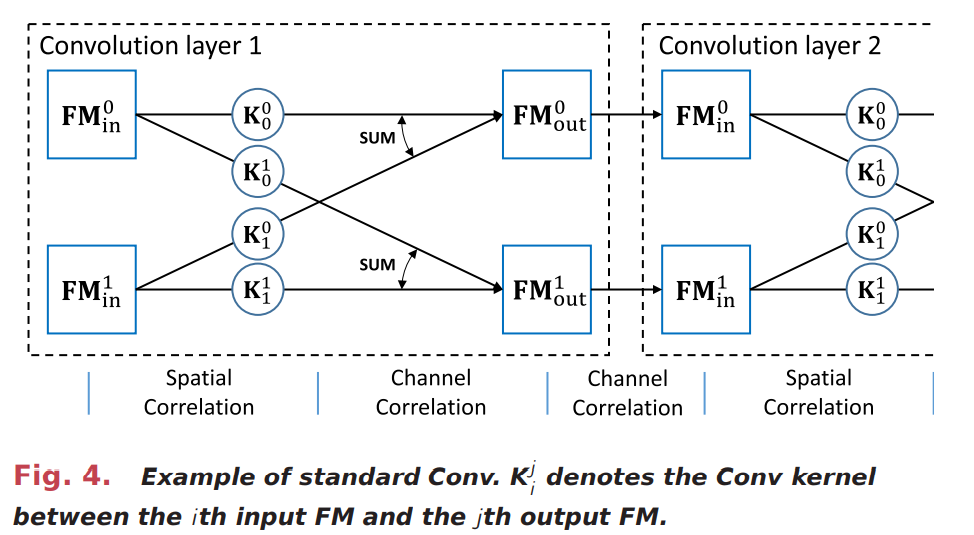
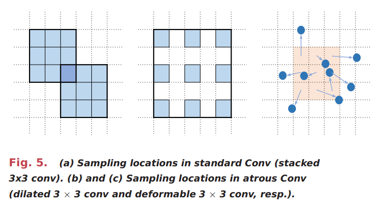
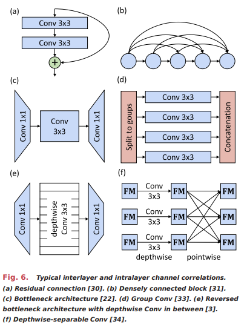

# 神经网络的模型压缩和硬件加速：综述

## 摘要

由于摩尔定律的可预见的终结，在通用处理器的改进速度下降的背景下，特定领域的硬件正成为一个有前途的话题。机器学习，尤其是深度神经网络（DNN），因为其在各种人工智能（AI）任务中的成功应用，已成为了最受瞩目的领域。  DNN的无与伦比的准确性是通过消耗大量的内存以及较高的计算复杂性来实现的，这极大地阻碍了它们在嵌入式系统中的部署。 因此，自然而然地提出了DNN压缩概念，并将其广泛用于节省内存和计算加速。 在过去的几年中，涌现了大量压缩技术，以在计算效率和应用准确性之间寻求令人满意的折衷。最近，这一浪潮已经蔓延到神经网络加速器的设计中，以获取超高的性能。 但是，相关工作量巨大以及报告的方法差异很大。这项混乱的研究促使我们对在高效压缩和执行DNN而不损害准确性的目标方面的最新进展进行全面的综述，涉及高级算法及其在硬件设计中的应用。 在本文中，我们回顾了主流的压缩方法，例如紧凑模型，张量分解，数据量化和网络稀疏化。 我们解释了它们的压缩原理，评估指标，敏感性分析和联合使用方法。 然后，我们回答了如何在神经网络加速器的设计中利用这些方法的问题，并提出了最新的硬件架构。 最后，我们讨论了几个问题，例如公平比较，测试工作负载，自动压缩，对安全性的影响以及框架/硬件级别的支持，并给出了该领域中研究方向以及可能遇到的挑战。 本文试图使读者快速建立起神经网络压缩和加速的概况，清楚地评估各种方法，并自信地以正确的方式开始。  

##  1. 简介，动机与概述

略

##  2. 神经网络概论

略

##  3. 神经网络压缩：算法

在本节中，我们首先介绍本文针对各种神经网络压缩方法的总体分类，然后逐一详细介绍特定的方法。

### A. 压缩方法分类法

图3展示了我们对神经网络压缩中的不同方法进行了分类的分类法。

注意，这里为了清晰起见，该图中未包括采用多种方法进行的联合压缩。对于任何压缩方法，如果其目的是从一组候选对象自身创建基本模型，则该方法被认为是紧凑模型方法。相比之下，其他三种方法修改了给定的基本模型以减少内存和计算成本。具体来说，如果将神经网络中的原始张量拆分为更小的张量，我们将其称为张量分解。否则，我们必须做进一步的识别：如果减少了数据表示的位宽，那应该是数据量化的方法； 而如果使用较少的有效权重和/或神经元对计算图进行稀疏化，则它属于网络稀疏化方法。

除了四种压缩方法外，第二节还提到了三种网络：MLP(多层感知器)，CNN(卷积神经网络)和RNN(循环神经网络)。 鉴于以下原因，我们不基于网络类型进行分类。 首先，针对不同网络类型的方法有很多重叠之处。  FC层(全连接层)可被视为具有1×1特征图大小的Conv层(卷积层)。 因此，Conv层的许多压缩方法也可以在具有FC层的MLP或RNN中应用。 例如，在张量分解，数据量化和网络稀疏化中，我们认为大多数方法可以在不同的网络之间共享。 而在紧凑模型中，尽管CNN的空间相关性与RNN的单元级设计不兼容，但CNN的信道相关性与RNN的网络级设计在某种程度上相似。 第二，关于RNN和MLP的研究比CNN的研究少得多的原因主要是因为CNN在当前的AI任务中越来越流行，并且在CNN系列中用于比较的基准更加标准化，而不是方法不兼容； 此外，CNN的FC层可以包含MLP结构，因此只有很少的工作研究MLP的压缩。 最后，如果我们将不同的网络类型划分为不同的子部分，则由于在许多情况下使用共享方法，因此必须在每种方法中重复使用四种压缩方法，这可能会导致混乱。考虑到所有这些问题，我们将不同的压缩方法用作更高级别的分类法，并将不同网络上的工作插入每种方法中。
### B. 压缩模型
1. 紧凑的CNN-空间和通道相关性：自AlexNet在图像分类的重大突破以来，CNN已经迭代了许多架构和模型，它们实现了越来越高的准确性。 此外，它们的应用还扩展到其他计算机视觉任务，例如目标检测和语义分割，甚至具有一维卷积的顺序任务和具有三维卷积的视频流任务。 但是，性能的改善主要是由更深和更广的网络带来的，这些网络增加了参数和操作(例如乘法和累加) ，这通常会减慢它们的执行速度，尤其是在移动设备上。这激励了紧凑型模型的设计，从而减少了开销，同时尽可能地保持了准确性。
虽然针对每个具体任务可以采用不同的技术获得紧凑的网络，但是典型的和一般的趋势是更深层的结构，扩展的特征图，更复杂的分支拓扑，更灵活的Conv算法。在本节中，我们从图4所示的两个方面总结了二维Conv的代表性方法：
- Conv层内的空间相关性，其中特征图与多个权重核卷积

- 层内和层间通道相关性，其中特征图由不同的拓扑聚合。 具体来说，每个输出特征图对应于多个权重核，其中每个核可以通过卷积操作从输入特征图中提取一种类型的局部特征。 然后，通过聚合从多个输入特征图提取的特征，使输出特征图产生对输入数据的更高特征抽象。以类似的方式，多输出特征图通过不同的权值核产生不同的特征。 特征传播逐渐提高了从局部到全局的抽象水平，最终使得图像识别等网络决策成为可能。
	a. 空间相关性以扩大感受野：与MLP相比，CNN的关键特征是具有共享权重的局部连接，这导致感受野内的高空间相关性以及空间变换的不变性。因此，设计有效的感受野对于Conv层的表示能力至关重要，这由权重核大小和权重核模式共同确定。
	即使可以通过使用较大的内核大小简单地增大感受野，但这也会导致参数和运算的二次方增长。两个3×3Conv(C3×3)层的堆叠的有效射频大约为C5×5，但参数和操作减少了28%(表2)。可以将其视为对原始5×5卷积核施加正则化，然后将其分解为两个3×3卷积核的子集，并在其间注入非线性。使用3×3卷积核的原则在现代CNN中得到了广泛的应用。一个直观的问题出现了:我们可以积极使用较小的卷积核大小，例如3×1(不对称卷积核)或2×2(偶数卷积核)吗?
	对于非对称情况，可以将$n×n$Conv分解为$n*1$Conv和$1×n$Conv，因此参数和运算从$O(n^2)$急剧减少到$O(2n)$。实验表明，不对称的Conv在尺寸为12–20的特征图上可以得到良好的结果。而对于2×2内核的情况，将C3×3分解为两个C2×2只会节省11%的开销。此外，偶数大小的内核必定会使零填充不对称，并导致半像素偏移的结果。堆叠多个偶数大小的Conv层时，这种位置偏移会累积，最终将空间信息压缩到原始输入特征图的某个角落。因此，在ShiftNet中，作者通过将3×3卷积核替换为各向同性的特征图移位，然后是1×1逐点转换，来直接利用移位效应并扩大感受野，然后在无需参数和MAC的情况下实现空间相关性。
	扩大感受野的另一种方法是使用atrous Conv，也称为空洞卷积。 如图5所示，atrous Conv使用具有孔，空洞或分散组织的不规则内核。空洞卷积支持不会降低分辨率或覆盖范围感受野的指数扩展。空洞算法可以使用不同的膨胀因子将相同的卷积核应用于不同的范围，从而在不影响分辨率的情况下聚合多尺度上下文信息。空洞卷积有效地扩大了感受野，而无需增加参数和MAC的数量，这特别适合于密集预测任务，例如语义分割，语音生成和机器翻译。Deformable Conv是atrous Conv的推广，它通过附加的二维偏移量并直接从目标任务中学习偏移量，从而增加了卷积核的空间采样位置。因此，可变核更加针对特定的任务，大大提高了对几何变换的建模能力。
	
	b. 通道相关性-拓扑技术：除了扩大感受野之外，大多数关于紧凑型CNN的研究都集中在网络结构上，即卷积层内或卷积层间的通道聚合拓扑。
	在VGG-Net中，层间拓扑非常简单，其中多个Conv层从头到尾依次堆叠。 然而，随着网络的加深，在实践中准确度会饱和并迅速下降，这被称为退化问题。在这种情况下，SGD优化器似乎很难找到更好的解决方案。为了解决这个问题，Inception-V1添加了两个额外的辅助分类器，这些分类器连接到中间层，以帮助将梯度传播回去。
	一种更有效，更优雅的方法是捷径连接，其中一个Conv层的输入和几个堆叠的Conv层之后的输出通过门或恒等函数连接。具体来说，可以将ResNet[参见图6(a)]中使用的恒等连接的示例表示为
	$$
	x_{l+2}=Conv_{l+1}(Conv_l(x_l))+x_l
	$$
	其中$x_l$是第$l$层的输入，$Conv_l(·)$表示该层内的卷积操作和激活函数。ResNet通过减少梯度消失并因此极大地增加了深度（超过100层）来获得精度提高。ResNet的一种解释是，超深层网络由恒等连接分解，并形成为相对较浅的网络的集合使其更加容易训练。与ResNet相似但又不同，DenseNet通过紧密连接的块
	$$
	x_{l+1}=Conv_l([x_0,x_1,...,x_l])
	$$
	构造捷径连接，其中$[x_0,x_1,...,x_l]$是指由所有先前的层产生的特征图的串联[见图6(b)]。通过特征重用来挖掘网络潜力，从而生成更多高参数效率的压缩模型。
	
	上述网络由相对简单的层和模块依次组成。网络深度或宽度的进一步增加通常会导致性能增益递减(例如，一个1202层的ResNet的性能比110层的ResNet差)，同时成本和参数和操作都呈二次增长。
  Conv层（层间）内的通道拓扑旨在减少标准Conv的开销。对于每个输出通道，Conv可以分为两个步骤（参见图4）：
   - 对于每个输入通道，通过与权重核（空间相关性）卷积来获得Conv结果
   - 线性聚合来自不同输入信道的所有Conv结果(信道相关性)。
  第一个想法是显式地利用线性信道相关性，或网络中的网络（NIN）中使用的逐点C1×1。 尽管C1×1本质上是所有输入特征图上的线性投影，而没有任何空间相关性，但它可以减少通道数量而不会产生负面影响。该原则后来形成为瓶颈结构[见图6（c）]：瓶颈结构不是使用具有$n$个扇入FM和$n$个扇出FM的单个标准C3×3，而是首先使用C1×1将n个FM投影到$n/k$个FM，然后执行$k$次标准的C3×3降低尺寸，最后通过另一个C1×1将$n/k$FM投影回$n$个FM。瓶颈架构也有逆版本[请参见图6（e）]。
  减少Conv开销的另一种方法是Group Conv。 群卷积的实现很简单，即将$n$个扇入FM和$n$个扇出FM分为$k$个单独的群，其中每个群具有$n/k$个扇入FM和$n/k$个扇出FM [请参见图 [6（d）]。 计算如下：
  
  $$
  x_{l+1}=[Conv^1_l(x^1_l),Conv^2_l(x^2_l),...,Conv^k_l(x^k_l)]
	$$
	其中$k$表示群索引。Group Conv特别适合在每个GPU内存不足的情况下在多个GPU上进行分布式训练。ResNeXt是ResNet的分组转换版本，可提高准确性。Condensenet在原始DenseNet的基础上引入了一个learned group Conv。在训练期间，learned group Conv会去除C1×1连接，并在推理过程中重新排列它们，以便将所得模型实现为标准的一对一群卷积。堆叠多个群卷积的副作用是，某个通道的输出仅来自某组输入通道。此特性强烈地正则化了信道相关性，并削弱了网络的表达能力。ShuffleNet通过通道洗牌操作克服了这一问题，它可以重新排列FM并链接不同组之间的通道。高等人提出了一种通道级的Conv融合来自不同通道组的信息。在[39]中对Group Conv进行了进一步的研究，其中每个Conv块由多个交错的群卷积（IGC）组成，并且每个卷积具有不同的置换策略和卷积核大小。

## 4. 神经网络压缩：硬件

略

## 5. 总结与讨论

略
